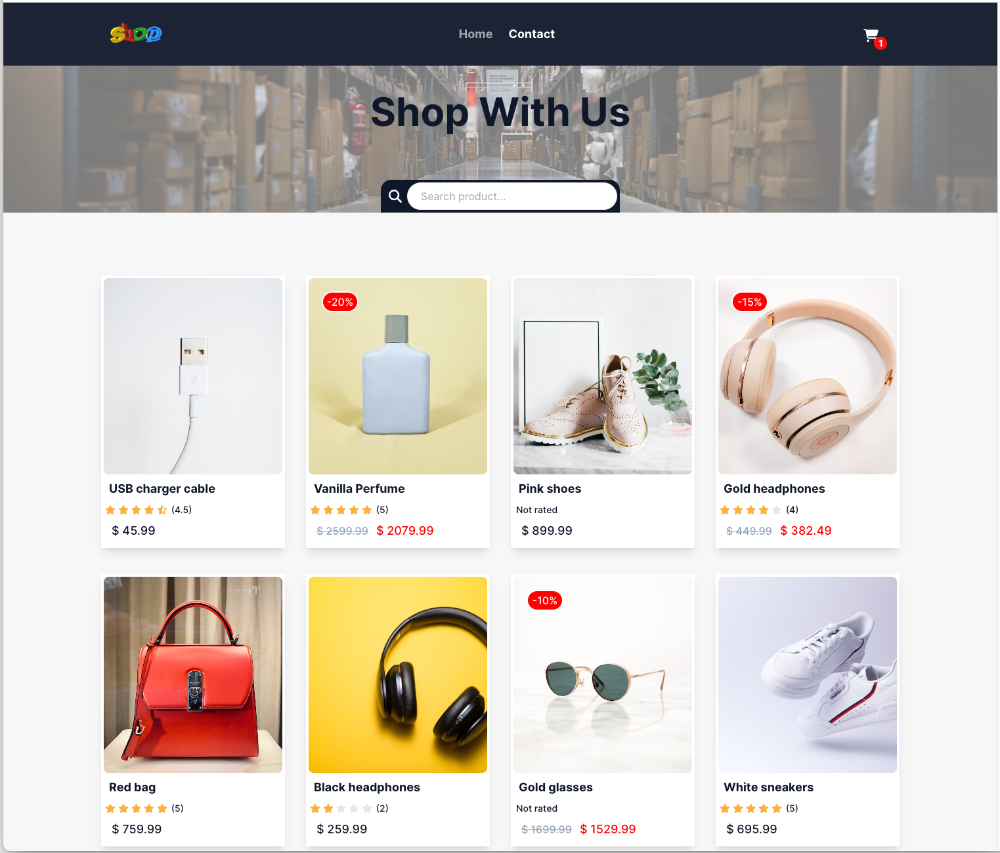

# React eCom Store



A React e-commerce store project built as a school assignment.

## Description

### Goal

The goal of this project is to apply knowledge of React by building an e-commerce store.
The following pages should be built for the e-commerce store:

- Homepage
- Individual product page
- Cart page
- Checkout success page

#### Homepage

- The homepage should display a list of all the products.
- There should be a look-ahead search bar that filters products when typing in a product name.
- Clicking on a product should take the user to the individual product page.

#### Individual Product Page

- The individual product page should display data for a single product.
- There should be an "Add to Cart" button that adds the product to the cart upon clicking.
- The product page should display the title, description, and image of the product.
- Reviews for the product should be listed if available.
- The discounted price property should be used to display the price of the product.
- If there is a difference between the discounted price and the regular price, it indicates a discount. Calculate and display the discount on the page.

#### Cart Page

- Clicking on the Cart icon should load the Cart page.
- The Cart page should list all the products added to the cart.
- The total price of the products should be displayed.
- The Cart page should have a Checkout button.

#### Checkout Success Page

- The Checkout success page should display a message notifying the user that their order was successful.
- A link should be provided to allow the user to go back to the store.
- The cart must be cleared when the user reaches the Checkout success page.

#### Contact Page

- The contact page should contain a contact form with the following fields.
- Form validation is required for the following fields:
  - Full name (Minimum of 3 characters, required)
  - Subject (Minimum of 3 characters, required)
  - Email (Must be a valid email address, required)
  - Body (Minimum of 3 characters, required)

#### Additional Requirements

- React Router should be used for page navigation.
- The design should be responsive.
- You are welcome to use a CSS Framework.
- Clean and well-formatted code is expected.

## Built With

You can list a the tech stack that you've used over here

- [React.js](https://reactjs.org/)
- [Reudx Toolkit](https://redux-toolkit.js.org/)
- [Tailwind CSS](https://tailwindcss.com/)

## Getting Started

### Installing

1. Clone the repo:

```bash
git clone https://github.com/VLazari/react-project-ca.git
```

2. Install the dependencies:

```
cd react-project-ca
npm install
```

### Running

To run the app, run the following commands:

```bash
npm run dev
```
Open http://localhost:[port] to view the app in your browser.

## Contributing

Contributions are welcome! If you have any suggestions or improvements, feel free to open an issue or create a pull request.

## Contact

For any inquiries or questions, you can reach me via the following:

[My LinkedIn page](www.linkedin.com/in/viorel-lazari)

## Acknowledgments

I would like to acknowledge the following resources for their contributions to this project:

- Noroff School of Applied Science for providing the Online Shop API. The API served as the data source for this eCom store project, enabling the retrieval of product information, reviews, and more.

I am grateful to Noroff School of Applied Science for making this API available, allowing me to apply my knowledge of React to build this project.
